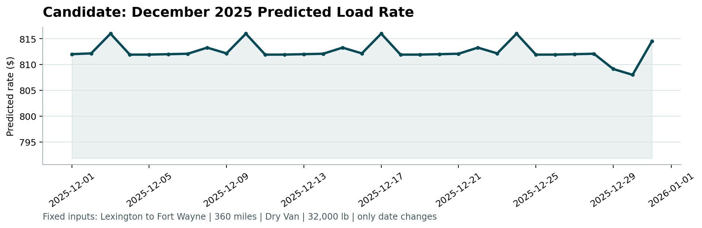

# 🚚 Freight Rate Prediction — ML Assessment

> **Predicting freight load rates** using a LightGBM + XGBoost ensemble with time-aware cross-validation.  
> **OOF MAE: $108.73 | R²: 0.874 | MAPE: 5.12%** across 5-fold temporal CV on 48,000 training loads.

---

## 📋 Table of Contents

- [Overview](#overview)
- [Results](#results)
- [Project Structure](#project-structure)
- [Setup & Installation](#setup--installation)
- [Usage](#usage)
- [Approach](#approach)
- [Feature Engineering](#feature-engineering)
- [Model](#model)

---

## Overview

This project solves a freight rate prediction task for a trucking/logistics marketplace. Given load characteristics (origin, destination, distance, equipment type, weight, date, and market signals), the goal is to predict the `posted_rate` — the price charged to ship a load.

| Dataset | Rows | Period |
|---|---|---|
| `train-test.csv` | 48,000 | Jan – Oct 2025 |
| `validation.csv` | 12,000 | Nov 2025 |
| `december-chart-inputs.csv` | 31 | Dec 2025 (fixed lane, one per day) |

---

## Results

| Metric | Value |
|---|---|
| OOF MAE | **$108.73** |
| OOF RMSE | $513.92 |
| OOF R² | **0.874** |
| OOF MAPE | **5.12%** |

**Per-fold MAEs** (5-fold time-ordered CV):

| Fold | Approx. Val Period | MAE |
|---|---|---|
| 1 | Mar 2025 | $110.68 |
| 2 | May 2025 | $88.69 |
| 3 | Jul 2025 | $112.05 |
| 4 | Sep 2025 | $119.19 |
| 5 | Oct 2025 | $113.06 |

### December 2025 Predictions (Lexington → Fort Wayne, 360 mi, Dry Van)



---

## Project Structure

```
ml_assessment/
├── train_model.py                      # Main ML pipeline — run this first
├── generate_eda.py                     # EDA chart generation
├── score.py                            # Provided scorer / validator (unchanged)
├── requirements.txt                    # All Python dependencies
│
├── train-test.csv                      # Training data (48K loads)
├── validation.csv                      # Test data (12K loads, no target)
├── validation-predictions-template.csv # Template for submission
├── december-chart-inputs.csv          # Dec fixed-lane inputs (filled by pipeline)
│
├── validation_predictions.csv          # ✅ Output: 12,000 predictions
├── eda_charts/                         # 8 exploratory visualizations
│   ├── 01_rate_dist_by_equipment.png
│   ├── 02_monthly_trend.png
│   ├── 03_rate_vs_distance.png
│   ├── 04_rpm_by_equipment.png
│   ├── 05_market_index_trend.png
│   ├── 06_correlation_heatmap.png
│   ├── 07_missing_values.png
│   └── 08_december_predictions.png
└── scorer_results/
    └── candidate_december.png          # ✅ Output: December chart
```

---

## Setup & Installation

**Requirements:** Python 3.9+

```bash
# Clone the repository
git clone https://github.com/naseemmig02/ml_assessment.git
cd ml_assessment

# Install dependencies
pip install -r requirements.txt
```

**Dependencies:**

| Package | Version | Purpose |
|---|---|---|
| `pandas` | ≥2.0 | Data loading & manipulation |
| `numpy` | ≥1.26 | Numerical operations |
| `scikit-learn` | ≥1.4 | CV, metrics, label encoding |
| `lightgbm` | ≥4.3 | Gradient boosting (fast) |
| `xgboost` | ≥2.0 | Gradient boosting (robust) |
| `matplotlib` | ≥3.8 | Visualization & scorer chart |

---

## Usage

### 1. Train the model & generate predictions

```bash
python train_model.py
```

This will:
- Load and clean `train-test.csv`, `validation.csv`, and `december-chart-inputs.csv`
- Engineer 39 features
- Run 5-fold time-aware cross-validation (LightGBM + XGBoost ensemble)
- Save `validation_predictions.csv` (12,000 rows)
- Fill `december-chart-inputs.csv` with `predicted_rate` values

### 2. Validate outputs & generate the December chart

```bash
python score.py \
  --predictions validation_predictions.csv \
  --december-predictions december-chart-inputs.csv
```

Output: `scorer_results/candidate_december.png`

### 3. (Optional) Regenerate EDA charts

```bash
python generate_eda.py
```

Output: 8 charts in `eda_charts/`

---

## Approach

### Data Cleaning

| Issue | Rows Affected | Fix |
|---|---|---|
| Missing `weight` | 300 (~0.6%) | Median per equipment type |
| Missing `market_index` | 374 (~0.8%) | Forward-fill by date, then global median |
| Extreme rate outliers | 48 (~0.1%) | Capped at 99.9th percentile ($12,855) |
| December missing columns | All 31 rows | Filled from train medians + hardcoded coords |

### Train / Validation Split

Data is **sorted by date** and split using `KFold(n_splits=5, shuffle=False)` so each fold's validation set is strictly later in time than its training set — simulating real production deployment:

```
Fold 1: ████░░░░░░  Train [Jan–Feb] → Val [Mar]
Fold 2: ████████░░  Train [Jan–Apr] → Val [May]
Fold 3: ████████░░  Train [Jan–Jun] → Val [Jul]
Fold 4: ████████░░  Train [Jan–Aug] → Val [Sep]
Fold 5: ████████░░  Train [Jan–Sep] → Val [Oct]
```

Out-of-fold (OOF) predictions cover every training row and are used for unbiased metric reporting. Test predictions are averaged across all 5 fold models for a bagging effect.

---

## Feature Engineering

39 features across 5 categories:

| Category | Features |
|---|---|
| **Geographic** (15) | Haversine distance, road tortuosity ratio, bearing, midpoint, region bins (W/C/E), cross-region flag |
| **Temporal** (15) | Month, DOY, DOW, week, quarter, is_weekend, month_start/end, **cyclical sin/cos** for month & DOW |
| **Load** (4) | `log(distance)`, `log(weight)`, weight-per-mile |
| **Market signals** (5) | `market_index`, `quote_signal`, + interaction terms with distance |
| **Categorical** (3) | Label-encoded pickup city, delivery city, equipment type |

---

## Model

**LightGBM + XGBoost ensemble** (equal-weight average).

```
Key hyperparameters:
  n_estimators    = 2000  (with early stopping @ 100 rounds)
  learning_rate   = 0.03
  subsample       = 0.8
  colsample_bytree= 0.8
  reg_alpha       = 0.1   (L1)
  reg_lambda      = 1.0   (L2)
  objective       = MAE (reg:absoluteerror / regression)
```

**Why this model?**
- Distance alone explains ~82% of rate variance (r = 0.909) with nonlinear equipment/market interactions — GBMs handle this natively
- Tabular freight data with mixed categorical/numeric features is precisely where GBMs excel
- Ensemble of LightGBM + XGBoost reduces variance through model diversity
- Interpretable feature importances for business insights
